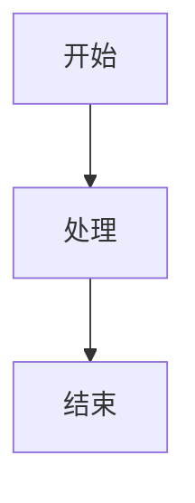

# 【<版本号>-<服务名>】<功能 / 模块名称>技术方案

# 背景

· Issue (问题)：<发生了什么，20字左右>
· Context (背景)：<系统状态/限制条件，20字左右>
· Decision (判断)：<团队决定怎么处理，20字左右>
· Why (原因)：<为什么这样选，20字左右>
· Who (负责人)：<谁为结果负责，20字左右>

# 目标

针对问题进行解构，列出所有目标项。

- <目标项 1>
- <目标项 2>
- <目标项 3>

# 技术实现

1. <简单描述功能实现>
2. <如果需要，补充相关图进行说明>

# 存储设计

<涉及到的存储相关调整；不涉及时写：无存储调整。>

# 接口设计

<涉及到的接口相关调整；不涉及时写：无接口调整。>

# 风险评估

<涉及到的风险评估。>

# 同行评审

无需填写

# 技术栈预警

<存在其他事情导致的技术妥协；没有时写：暂无。>

# 补充说明

<其他补充说明。>
