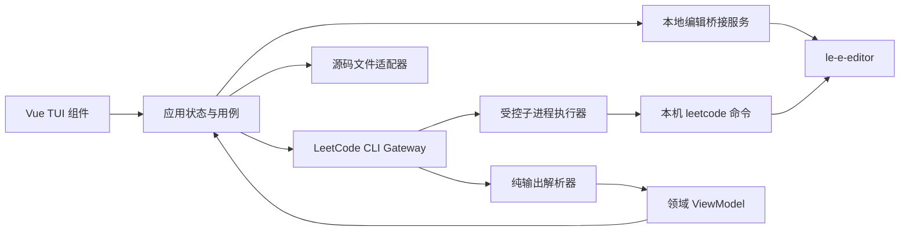
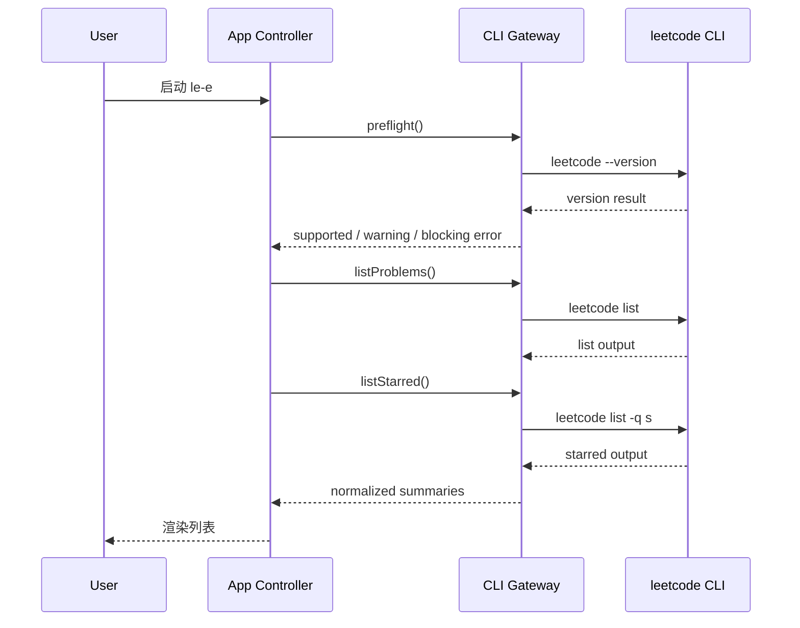
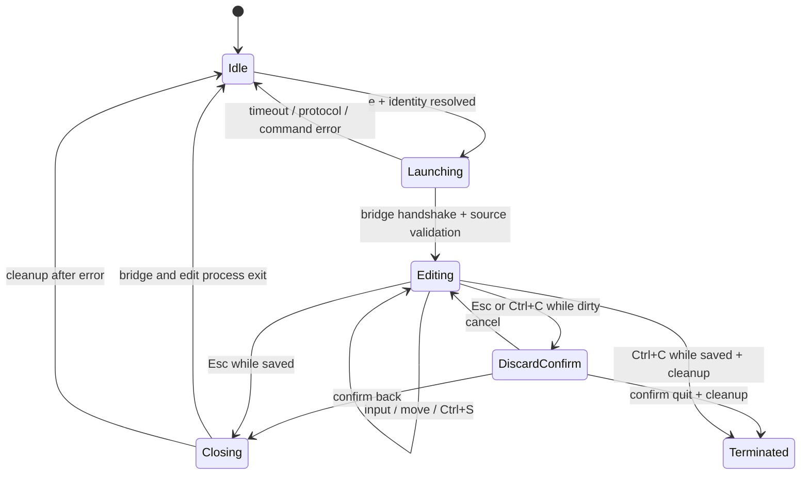
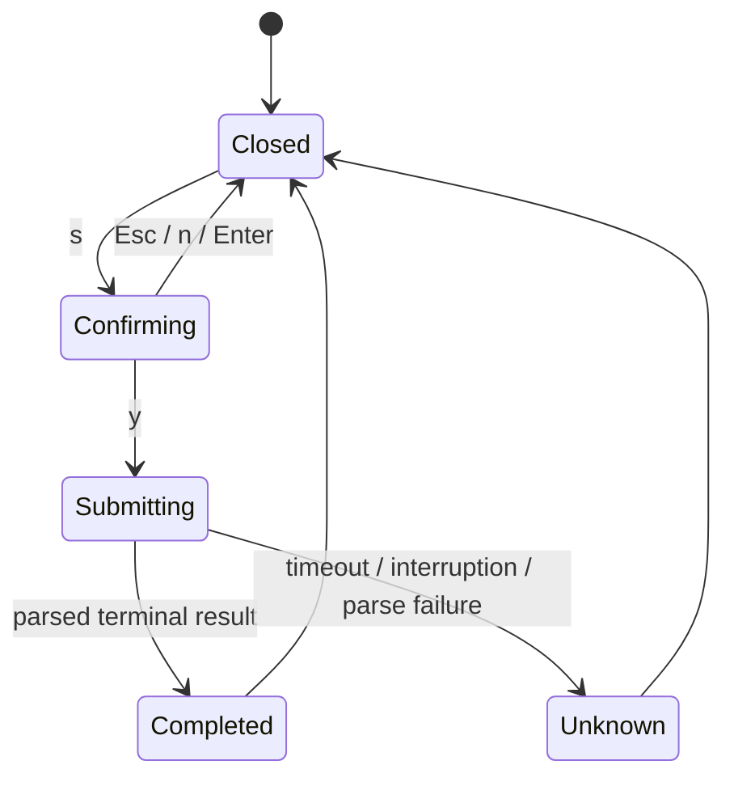

# LeetCode Vue TUI 设计规范

- 日期：2026-08-10
- 状态：历史设计；内嵌编辑器部分已于 2026-08-11 被 Vim-only 方案取代
- 项目命令：`le-e`
- 底层 CLI：`clearloop/leetcode-cli` 0.5.4（命令名 `leetcode`）
- UI 技术：Vue 3 + TypeScript + `@simon_he/vue-tui` 1.1.5

> 2026-08-11 修订：TUI 内嵌编辑器、未保存弹窗及其快捷键已经移除。当前唯一编辑入口为
> `e`，它通过源码桥接取得 CLI 生成的 JavaScript 路径，暂停 TUI 后打开本机 Vim，并在
> Vim 退出后恢复 TUI。下文涉及内嵌编辑器的章节仅保留为历史设计记录。

## 1. 摘要

`le-e` 是一个运行在终端中的 LeetCode 图形化界面。它复用用户已经安装并登录的
`leetcode` 命令，不直接访问浏览器 Cookie、CLI 缓存数据库或 LeetCode HTTP API。

首个版本提供题目浏览、标题搜索、难度筛选、收藏筛选、题目详情、TUI 内嵌代码编辑、
运行测试、提交确认和操作日志。普通界面采用左右主从布局，下方为固定日志区；编辑模式
使用全屏代码区。终端小于 `100x28` 时只显示尺寸提示，不尝试压缩成另一套布局。

## 2. 背景与问题

现有 `leetcode` CLI 已经解决登录、题目缓存、代码文件和远端调用，但其命令之间缺少
连续的工作区体验：用户需要反复输入题号、记忆参数，并在列表、编辑器、测试输出和
提交之间手动切换。

另外，本机 0.5.4 版本有两项必须由上层规避的行为：

1. 语言标识区分大小写，JavaScript 的有效值是 `javascript`。
2. 不支持的语言可能先触发临时测试文件清理，再以 `Io(NotFound)` 掩盖原始参数错误。

TUI 因此必须用受控参数构造命令，并把默认语言固定为小写 `javascript`。

## 3. 目标

首个版本必须做到：

- 在同一个终端界面中浏览题目并查看详情。
- 按标题或数字 ID 搜索，按 Easy、Medium、Hard 和收藏状态过滤。
- 通过 `leetcode edit` 和受控编辑器桥接取得 CLI 生成的真实 JavaScript 源码文件，并在
  TUI 内完成基础编辑和保存。
- 在 TUI 内显示 `leetcode test` 的标准输出、错误输出、耗时和最终状态。
- 只有用户在确认框中按 `y` 后才执行 `leetcode exec`。
- 将所有命令状态写入最多 500 行的内存日志，错误时不导致界面崩溃。
- 无论正常退出、`Ctrl+C` 还是异常，都恢复终端光标、raw mode 和备用屏幕。
- 保留可替换假 CLI 的既有自动化测试，并用假 CLI 手工验收内嵌编辑链路；任何验证过程都
  不发起真实提交。

## 4. 非目标

首个版本不包含：

- 运行时直接读取 Chrome Cookie、CLI SQLite 缓存或 LeetCode 配置中的 Cookie 字段；一次性
  setup 只定点替换 `[code].editor`，并将原编辑器名称保存为不含凭据的回退配置。
- 直接调用 LeetCode 或力扣 HTTP/GraphQL API。
- 命名收藏夹；“收藏”仅指 CLI 的 starred 集合，即 `leetcode list -q s`。
- 语法高亮、行号、代码 diff、自动补全、撤销/重做、搜索、多光标、自动保存和崩溃恢复。
- 每日一题、提交统计、缓存管理、账号管理和站点切换页面。
- Database、Shell、Concurrency 等独立题库导航。
- 小于 `100x28` 的窄屏响应式布局。
- 自动重试提交、后台自动提交或自动修改用户代码。
- 全局 npm 安装包发布；首版以仓库内 `pnpm` 命令运行。

## 5. 运行时与依赖基线

### 5.1 支持矩阵

- 开发与验证基线：Node.js 22 LTS，最低 `22.12.0`。
- 包管理器：pnpm 11，提交 `pnpm-lock.yaml`。
- 底层 CLI：以 0.5.4 为已验证版本；其他版本显示兼容性警告，不伪装成已验证。
- 操作系统：首版验证 macOS；进程层保持 Node 跨平台 API，但不承诺 Windows 验收。
- 终端：支持 ANSI、raw input 和 alternate screen 的交互式终端。

之所以固定 Node 22 LTS，是因为设计时本机 Node 23 可以运行 CLI，但当前 Vitest 4 的
引擎范围不包含 Node 23。开发、CI 和验收必须使用同一受支持版本，避免测试工具在奇数
版本 Node 上产生不可重复结果。

### 5.2 依赖策略

运行时依赖：

- `vue`：3.5 系列。
- `@simon_he/vue-tui`：精确使用 1.1.5，并由 lockfile 固定解析结果。
- `strip-ansi`：移除子进程输出中的 ANSI 控制序列。
- `string-width`：按终端单元格宽度截断中英文标题，而非按 JavaScript 字符数截断。

开发依赖：

- Vite 8 与 `@vitejs/plugin-vue`：以 terminal mode 产出 Node 可执行 bundle。
- TypeScript、`vue-tsc`：严格类型检查。
- Vitest 4：保留并运行已经落地的单元、状态、进程和 Gateway 测试。
- ESLint、Vue ESLint 插件和 Prettier：静态检查及格式门禁。
- `vite-node`：开发态执行 Vue/TypeScript 入口。

只允许使用 `@simon_he/vue-tui` 的稳定根入口和公开的 `@simon_he/vue-tui/cli` 入口；
首版不依赖 `experimental` 子路径。版本升级必须先重新跑既有测试，并重复 headless 渲染、
键盘流和假 CLI 手工验收。

### 5.3 预期脚本

```text
pnpm dev           # 用 vite-node 启动开发态终端应用
pnpm build         # vite build --mode terminal
pnpm start         # node dist-terminal/main.js
pnpm setup:editor --apply   # 将 CLI editor 指向本项目桥接程序
pnpm setup:editor --restore # 恢复 setup 前的 editor
pnpm test          # vitest run
pnpm typecheck     # vue-tsc --noEmit
pnpm lint          # eslint .
pnpm format:check  # prettier --check .
pnpm check         # 顺序执行 format:check、lint、typecheck、test、build
```

## 6. 架构

系统以四层主架构加一个本地编辑桥接边界组成，依赖只向下：



### 6.1 展示层

Vue 组件只负责布局、焦点样式、按键到意图的映射和状态渲染。`CodeEditor.vue` 只渲染
`CodeBuffer` 并发送编辑意图；组件不能直接创建子进程、解析 CLI 文本或读写文件系统。
首版不引入 Pinia；根级组合式状态控制器足以覆盖单页面状态，并降低终端生命周期与全局
store 之间的耦合。

### 6.2 应用层

应用控制器负责：

- 启动自检和初始刷新。
- 题目、收藏、筛选、选中项、焦点、日志和活动操作状态。
- 串行调度命令，保证任意时刻最多一个活动子进程。
- 内嵌编辑会话、未保存确认和提交确认状态机。
- 将 Gateway 的结构化结果转换成可见状态，不接触原始 ANSI 文本。

### 6.3 Gateway 层

`LeetCodeGateway` 是底层 CLI 的唯一入口。它接收类型化请求、构造固定参数数组、调用
进程执行器，再将输出交给纯解析器。所有调用使用 `shell: false`，不得拼接 shell 字符串。

### 6.4 进程层

进程执行器负责超时、取消、stdout/stderr 上限、退出码、信号、环境白名单和耗时。它不
理解 LeetCode 业务，也不决定错误提示文案。编辑命令使用 captured-stdio 并额外注入本次
会话的 Socket 路径和随机令牌；所有进程都使用 `shell: false`。

## 7. 建议目录结构

```text
le-e/
├── .ai/tasks/
├── docs/superpowers/specs/
├── scripts/
│   └── fake-leetcode.mjs
├── src/
│   ├── main.ts
│   ├── editorBridgeMain.ts
│   ├── App.vue
│   ├── application/
│   │   ├── createAppController.ts
│   │   ├── codeBuffer.ts
│   │   ├── editorSession.ts
│   │   ├── filters.ts
│   │   └── submitState.ts
│   ├── components/
│   │   ├── HeaderBar.vue
│   │   ├── ProblemList.vue
│   │   ├── ProblemDetail.vue
│   │   ├── LogPanel.vue
│   │   ├── SubmitDialog.vue
│   │   ├── HelpOverlay.vue
│   │   ├── CodeEditor.vue
│   │   ├── UnsavedDialog.vue
│   │   └── ResizeNotice.vue
│   ├── domain/
│   │   ├── problem.ts
│   │   ├── operation.ts
│   │   └── errors.ts
│   ├── infrastructure/
│   │   ├── editorBridgeProtocol.ts
│   │   ├── sourceBridgeServer.ts
│   │   ├── sourceFile.ts
│   │   ├── editorSetup.ts
│   │   ├── leetcodeGateway.ts
│   │   ├── processRunner.ts
│   │   ├── terminalLifecycle.ts
│   │   └── parsers/
│   │       ├── listParser.ts
│   │       ├── detailParser.ts
│   │       └── outputSanitizer.ts
│   └── styles/
│       └── theme.ts
├── tests/
│   ├── fixtures/leetcode-0.5.4/
│   └── unit/
├── package.json
├── pnpm-lock.yaml
├── tsconfig.json
├── vite.config.ts
└── vitest.config.ts
```

## 8. 领域模型

核心类型的语义如下：

```ts
type Difficulty = 'Easy' | 'Medium' | 'Hard'
type SolveStatus = 'solved' | 'unsolved' | 'locked' | 'unknown'

interface ProblemSummary {
  id: number
  title: string
  difficulty: Difficulty
  acceptance: number | null
  solveStatus: SolveStatus
  starred: boolean
  identityStatus: 'provisional' | 'resolved' | 'conflict'
}

interface ProblemDetail {
  id: number
  title: string
  statement: string
  fetchedAt: number
}

interface CommandResult {
  command: string
  args: readonly string[]
  exitCode: number | null
  signal: NodeJS.Signals | null
  stdout: string
  stderr: string
  durationMs: number
  timedOut: boolean
  cancelled: boolean
  truncated: boolean
}

type OperationKind =
  | 'preflight'
  | 'refresh-list'
  | 'refresh-starred'
  | 'load-detail'
  | 'edit'
  | 'test'
  | 'submit'
```

`ProblemSummary.id` 是所有后续 CLI 命令的唯一操作键。UI 不保留或展示任何 Cookie、
CSRF、session token 或子进程环境变量。应用另外按 ID 保存本次进程中是否已成功完成
`edit --lang javascript` 的 source-ready 状态；这个状态不跨进程持久化。

编辑会话另有以下状态，且只存在于内存：

```ts
type EditorPhase = 'idle' | 'launching' | 'editing' | 'closing'

interface EditorSession {
  phase: EditorPhase
  problemId: number | null
  fileName: string | null
  lines: string[]
  cursorRow: number
  cursorColumn: number
  scrollRow: number
  preferredColumn: number | null
  dirty: boolean
}
```

## 9. CLI 命令契约

### 9.1 启动自检

```text
leetcode --version
```

- 找不到可执行文件：显示阻断页，附安装/检查 `PATH` 的提示。
- 输出 0.5.4：标记为已验证。
- 其他可解析版本：显示持续可见的兼容性警告，允许用户刷新列表。
- 无法解析版本或命令非零退出：阻断启动，并把已净化输出写入日志。

自检不读取配置文件，也不通过浏览器检查登录。登录状态只能依据真实 CLI 操作返回的
错误进行判断，不能把“收藏为空”误判成“未登录”。

### 9.2 初始列表与刷新

```text
leetcode list
leetcode list -q s
```

两条命令顺序执行，以满足“最多一个活动操作”。第一条建立可操作题目列表，第二条建立
starred ID 集合。刷新键 `r` 重跑两条命令；任一条失败都保留上一次成功快照，并显示数据
可能过期。

0.5.4 在 `leetcode.cn` 可能返回相同数字 ID 的多条记录，而 `pick/edit/test/exec` 又只
接受数字 ID。解析列表时按 CLI 输出顺序将每个 ID 的第一条记录作为 provisional 展示项，
同时在内存中保留该 ID 的其他 collision candidates，并在 debug 日志中记录重复数量。
搜索和难度筛选只作用于 provisional/已解析列表，不能重新调用带关键词的
`leetcode list`，否则一次搜索可能产生与后续命令更不一致的候选集合。

重复 ID 的原始顺序并不是可靠身份保证，因为 0.5.4 对等值 ID 使用不稳定排序，而
`pick` 又从 SQLite 取首条匹配记录。任何 `edit/test/submit` 前都必须先成功执行
`leetcode pick <id>`，并同时校验返回标题：

- 标题匹配当前展示项：将其标记为 `resolved`。
- 标题匹配某个 collision candidate：用该 candidate 替换展示项并标记为 `resolved`。
- 标题不匹配任何 candidate：标记为 `conflict`，显示 CLI 返回标题，但禁止编辑、测试和
  提交，直到用户刷新后重新解析。

因此列表首屏可以快速出现，但所有会读写代码或发起远端动作的路径都建立在 CLI 自己
确认过的 ID + 标题对上。

收藏集合也按 ID 合并：只要 `list -q s` 中出现规范化题目的 ID，就将其 `starred` 设为
`true`。这与底层 CLI 的按 ID 操作能力一致，但不扩展成命名收藏夹语义。

### 9.3 题目详情

```text
leetcode pick <id>
```

`<id>` 必须来自当前规范化列表并转换为十进制字符串。解析器提取首行中的 ID 和标题，
其余正文保留换行但移除 ANSI/危险控制字符。ID 和规范化标题共同完成上一节的身份解析。
详情按 ID 做仅限当前进程的内存缓存；`r` 刷新后缓存及 identity status 失效。解析失败时
右栏显示可恢复错误，日志保留有上限的净化输出。

### 9.4 内嵌编辑器与 CLI 桥接

```text
leetcode edit <id> --lang javascript
```

参数顺序固定，语言不接受 UI 自由输入。TUI 不复制模板、不猜测源码路径，而是保留
`leetcode edit` 作为唯一的模板和路径所有者。一次性 setup 将 CLI 的 `[code].editor`
定点替换为仓库构建出的 `le-e-editor` 绝对路径，并把原编辑器名称保存到不含 Cookie 的
`le-e` 用户配置；运行时不读取 CLI 配置或 SQLite 缓存。

setup 的回退配置固定写入 `$XDG_CONFIG_HOME/le-e/config.json`，未设置 XDG 时使用
`~/.config/le-e/config.json`，文件权限为 `0600`，内容只包含原编辑器名称。setup 对
`~/.leetcode/leetcode.toml` 做行级定点替换：保留原权限和除 `[code].editor` 值外的原始
字节，以同目录临时文件原子替换；如果缺少唯一的 `[code]` 或 `editor` 键、格式有歧义，
则拒绝修改并输出不含配置值的手工操作提示。setup 不创建含 Cookie 的备份文件。
`--restore` 只在当前 editor 仍等于本项目桥接路径时恢复原值；若用户此后已经自行修改，
则拒绝覆盖。`--apply` 和 `--restore` 都由用户显式执行，应用启动时不会静默改配置。

按 `e` 后的固定流程为：

1. 题目先由 `pick` 完成 ID + 标题解析。
2. TUI 在权限为 `0700` 的随机临时目录创建 Unix Socket，并生成随机会话令牌。
3. TUI 以 captured stdio 启动 `leetcode edit <id> --lang javascript`，只向该子进程注入
   Socket 路径和令牌；TUI 保持 raw mode 和全屏渲染。
4. CLI 创建或选择真实源码文件后启动 `le-e-editor`。桥接进程通过 Socket 发送协议版本、
   令牌和 CLI 传入的最后一个源码路径参数，然后等待 TUI 结束编辑会话。
5. TUI 只接受当前用户拥有、非符号链接、`.js` 后缀、小于等于 1 MiB 的普通文件；验证
   通过后读取内容并进入全屏编辑模式。
6. `Ctrl+S` 通过同目录临时文件原子替换真实源码文件，并保留原权限、换行风格和末尾
   换行。保存失败或检测到外部修改时保留内存内容，不覆盖原文件。
7. `Esc` 在没有未保存内容时结束编辑；有未保存内容时先进入放弃确认。关闭后通知桥接
   进程退出，等待 `leetcode edit` 正常结束，再标记该题 source-ready。

桥接握手最长等待 5 秒。超时、协议错误、令牌错误或文件校验失败都会终止 edit 子进程、
清理 Socket 并显示结构化错误，不进入编辑模式。`le-e-editor` 在没有 TUI Socket 环境时
调用 setup 保存的原编辑器；原编辑器为空、指向桥接自身或不可用时回退到 `vim`。回退
调用同样使用 `shell: false`，CLI 的原 `editor-args` 原样作为参数传递。

在 0.5.4 中，`--lang javascript` 会先把 CLI 的 `[code].lang` 持久化为 `javascript`，
并生成/打开该语言的代码文件；后续 `test` 和 `exec` 都依赖这个当前语言，且自身没有
`--lang` 参数。因此应用采用以下安全门：

- 题目必须先由 `pick` 完成 ID + 标题解析，才能按 `e`。
- 只有源码路径校验成功、用户结束内嵌编辑且 `leetcode edit ... --lang javascript` 正常
  返回后，才在本次 TUI 进程中将该 ID 标记为 source-ready。
- 未 source-ready 的题目按 `t` 或 `s` 时不运行命令，而是提示先按 `e` 准备/确认文件。
- 重启 TUI 后 source-ready 集合为空；即使文件已存在，也需要按一次 `e` 让 CLI 明确
  选中 `javascript`。已有文件不会被模板覆盖，只会在 TUI 中打开。

0.5.4 本身不向父进程公开代码路径，也不传播编辑器自身的非零退出码。桥接协议只补足
源码路径交付和会话结束通知，不读取 Cookie、数据库或题目接口；source-ready 证明 CLI
已为该 ID 选择/创建 JavaScript 文件、路径通过校验且编辑命令完成，但不等同于测试通过。

### 9.5 测试

```text
leetcode test <id>
```

测试捕获 stdout/stderr 并实时追加到日志区。首版不提供自定义 testcase 和 `--watch`。
最近一次测试状态按题目 ID 保存为 `not-run`、`running`、`passed`、`failed`、`unknown`。
只有命令正常退出且输出解析为通过时才记作 `passed`；无法判断时必须是 `unknown`，不得
根据退出码盲目显示绿色通过。题目必须同时是 `resolved` 和 source-ready 才能进入测试。

### 9.6 提交

```text
leetcode exec <id>
```

按 `s` 只打开确认框，不启动进程，且题目必须同时是 `resolved` 和 source-ready。确认框
展示题号、已由 `pick` 校验的标题、语言 `javascript`、文件状态“本次会话已由 CLI 为
该题准备（实际路径由 CLI 配置管理）”，以及该题最近一次测试状态。取消为默认焦点：
`Esc`、`n`、Enter 均取消；只有小写或大写 `y` 才执行一次提交。

提交不自动重试。超时、进程被中断、网络断开或无法解析返回值时显示“结果未知，请在
CLI/网站核验”，不得显示失败后可安全重试的暗示。

## 10. 输出解析

解析器必须是无副作用纯函数，输入原始字符串，返回领域对象或结构化解析错误。

列表解析流程：

1. 移除 ANSI 序列和回车符。
2. 逐行识别状态标记、方括号数字 ID、标题、难度和可选通过率。
3. 按 Unicode 单元而非纯空格列宽解析标题，兼容中文和 emoji。
4. 忽略空行；无法识别的非空行计入诊断，但不让整个列表崩溃。
5. 对 ID 做首条保留去重，并输出 `duplicateCount` 和 `unparsedLineCount`。
6. 若非空输出中一条题目也未解析到，则返回 `PARSE_ERROR`，保留旧快照。

详情解析流程：

1. 识别形如 `[1] Two Sum is on the run...` 的头部。
2. 头部后的文本作为题面；规范化换行，不改写题面内容。
3. 若头部 ID 与请求 ID 不一致，视为不可恢复的该次解析错误。
4. 将头部标题做空白规范化后与展示项及 collision candidates 比较；没有匹配项时进入
   `conflict`，防止展示和操作错题。

日志输出先进行以下净化：

- 移除 ANSI 和除换行、制表符外的 C0/C1 控制字符。
- 对包含 `LEETCODE_SESSION`、`csrftoken`、`cookie`、`authorization` 等名称的赋值或
  header 值做整值替换，统一显示 `[REDACTED]`。
- 单行最多保留 4 KiB，单个流最多捕获 1 MiB，超限标记 `[TRUNCATED]`。
- 不记录 `process.env`，不读取或打印配置文件内容。

## 11. 界面设计

### 11.1 正常布局（最小 100x28）

```text
┌ le-e · leetcode 0.5.4 · target javascript ─────────────────────────────────┐
│ Search: two sum   Difficulty: All   Favorite: Off   Status: Ready          │
├──────────────────────────────────────┬──────────────────────────────────────┤
│ Problems                             │ Detail                               │
│ > 1  Two Sum                 Easy    │ [1] Two Sum                          │
│   2  Add Two Numbers        Medium   │ Given an array of integers...        │
│   …                                  │                                      │
├──────────────────────────────────────┴──────────────────────────────────────┤
│ Log · test #1 · passed · 842ms                                              │
│ stdout: Accepted                                                            │
├──────────────────────────────────────────────────────────────────────────────┤
│ ↑↓/jk move  Enter detail  / search  f favorite  d difficulty  ? help  q quit│
└──────────────────────────────────────────────────────────────────────────────┘
```

- 顶部两行：运行信息和筛选状态。
- 中间区：左侧约 42%，右侧约 58%；各自独立滚动。
- 日志区：默认固定显示 6 行，可用 `l` 收起为单行状态条或恢复。
- 底部：只显示当前上下文中有效的主要按键。
- 当前焦点以边框和前缀同时表示，不能只依赖颜色。
- Easy、Medium、Hard 使用不同颜色，同时始终显示文本，满足无色终端可理解性。

### 11.2 尺寸不足

当列数小于 100 或行数小于 28 时，停止渲染业务布局，只显示当前尺寸、要求尺寸和退出
提示。尺寸恢复后回到原状态，不能丢失选中题目、筛选条件或日志。

### 11.3 焦点与覆盖层

焦点顺序为筛选栏、题目列表、详情、日志，`Tab` 正向轮换，`Shift+Tab` 反向轮换。
提交确认框和帮助层打开时形成焦点陷阱，底层列表不响应业务快捷键。

### 11.4 全屏代码编辑

```text
┌ #1 Two Sum · JavaScript · 1.two-sum.js · Modified ─────────────────────────┐
│ var twoSum = function(nums, target) {                                      │
│   ▏                                                                         │
│ };                                                                          │
│                                                                             │
├─────────────────────────────────────────────────────────────────────────────┤
│ Ctrl+S save · Esc back · Tab 2 spaces · Ctrl+C quit                         │
└─────────────────────────────────────────────────────────────────────────────┘
```

编辑模式替换普通主从布局和日志区，但不销毁其状态。顶部显示题号、已解析标题、语言、文件
basename 和 `Saved`/`Modified`；不得展示完整用户目录。代码区不显示行号或语法高亮，使用
可见光标标记当前插入位置。底部只显示编辑上下文的按键。终端尺寸不足时切换到尺寸提示，
恢复后仍回到原编辑位置且不丢失内存内容。

## 12. 快捷键

- `↑` / `↓` 或 `j` / `k`：移动列表或当前滚动区域。
- `Enter`：加载/聚焦当前题目详情；在取消按钮上取消提交。
- `/`：进入搜索输入；`Enter` 应用，`Esc` 恢复进入前的搜索词。
- `f`：在全部题目和收藏题目之间切换。
- `d`：按 All → Easy → Medium → Hard → All 循环。
- `Tab` / `Shift+Tab`：轮换焦点。
- `e`：通过桥接打开当前题目的内嵌编辑器。
- `t`：测试当前题目。
- `s`：打开提交确认框。
- `l`：收起或展开日志区。
- `r`：刷新列表和收藏。
- `?`：打开/关闭帮助层。
- `q`：无覆盖层且无输入模式时退出。
- `Ctrl+C`：全局安全退出。

编辑模式独占键盘输入，不响应普通页面的 `j/k/e/t/s/r/q` 快捷键。它支持普通文本和终端
粘贴、`Enter`、`Backspace`、`Delete`、方向键、`Home`、`End`、`PageUp`、`PageDown`；
`Tab` 插入两个空格，`Ctrl+S` 保存，`Esc` 返回。`Ctrl+C` 仍表示退出整个应用。`Esc` 或
`Ctrl+C` 遇到 dirty 内容时打开放弃确认并记住“返回”或“退出”意图；确认前继续保留编辑
内容，确认后分别返回普通界面或完成全局安全退出。

当存在活动操作时，`e`、`t`、`s`、`r` 不启动第二个操作，并给出非阻塞提示。列表、
详情和测试可用 `Esc` 请求取消；已发出的提交不提供普通取消键。若用户通过 `Ctrl+C` 或
外部信号中断提交，只能记录为未知状态。

## 13. 关键状态流

### 13.1 启动与刷新



初次加载期间显示骨架和当前命令。若列表失败，界面仍可查看日志和帮助，但禁用依赖选中
题目的动作。

### 13.2 内嵌编辑会话



编辑会话全程保持 TUI renderer、stdin driver、raw mode 和 alternate screen；桥接子进程
只负责向 TUI 交付路径并等待关闭通知。任意失败都按“先停止 edit/bridge 子进程，再关闭
Socket 和临时目录，最后恢复应用状态”的顺序清理。cleanup 必须幂等，重复调用不能输出
额外控制序列、覆盖源码或抛错。

### 13.3 提交确认



## 14. 错误分类与用户提示

错误统一映射为稳定代码：

- `CLI_NOT_FOUND`：`leetcode` 不在 `PATH`。
- `CLI_VERSION_UNSUPPORTED`：版本不是已验证的 0.5.4。
- `AUTH_REQUIRED`：CLI 明确返回未登录、Cookie/CSRF/session 无效。
- `SITE_OR_NETWORK_ERROR`：CLI 明确返回站点、DNS、TLS、连接或 HTTP 错误。
- `COMMAND_TIMEOUT`：超过命令时限。
- `COMMAND_CANCELLED`：用户取消尚可安全取消的本地操作。
- `COMMAND_FAILED`：非零退出且没有更具体分类。
- `PARSE_ERROR`：命令有输出但无法转换为要求的领域数据。
- `SUBMIT_STATUS_UNKNOWN`：提交已经发出，但最终结果不能确定。
- `TERMINAL_RESTORE_FAILED`：无法可靠恢复终端状态，清理后退出。
- `EDITOR_BRIDGE_NOT_CONFIGURED`：5 秒内没有收到有效桥接握手，提示运行一次性 setup。
- `EDITOR_BRIDGE_PROTOCOL_ERROR`：协议版本、令牌或消息格式无效。
- `SOURCE_FILE_REJECTED`：路径不是合规的当前用户 JavaScript 普通文件。
- `SOURCE_FILE_CHANGED`：文件在本次编辑期间被其他程序修改，拒绝静默覆盖。
- `SOURCE_SAVE_FAILED`：原子保存失败，内存中的 dirty 内容继续保留。

分类只依据明确的退出信息和经过测试的文本模式。未知错误保留 `COMMAND_FAILED`，不得猜测
为登录错误。主界面显示短提示，详细净化输出进入日志。

## 15. 超时、取消与资源限制

- `--version`、列表、收藏、详情：30 秒。
- 测试和提交：120 秒。
- 编辑器桥接握手：5 秒；进入编辑状态后无时限，由用户退出编辑器。
- 任意时刻只有一个活动子进程。
- captured stdout 与 stderr 各 1 MiB；达到上限后终止命令并标记截断。
- 日志使用 500 行环形缓冲，最旧行先淘汰。
- 可取消命令先发送 `SIGTERM`，2 秒后仍未退出再发送 `SIGKILL`。
- 提交超时或进程被终止后永远是 `SUBMIT_STATUS_UNKNOWN`，不会自动再调用 `exec`。

## 16. 终端生命周期

入口使用 `createTerminalApp`、`createStdoutRenderer`、`createStdinDriver` 和
`installTerminalCleanup` 组成终端应用。项目在其外再包一层幂等生命周期控制器，以统一
处理：

- 正常 `q` 退出。
- `SIGINT`、`SIGTERM`。
- `uncaughtException`、`unhandledRejection`。
- 内嵌编辑和桥接子进程的异常清理。
- 初始化到一半时失败。

cleanup 的最低保证是关闭 raw mode、显示光标、离开 alternate screen、移除进程监听器，
然后才允许进程退出。异常详情写到 stderr 时也必须先净化，不能转储环境变量。
内嵌编辑不会主动暂停或重建终端生命周期；只有正常退出、信号、未捕获异常或初始化失败
才执行全局 cleanup。

## 17. 测试设计

用户明确要求内嵌编辑器变更不新增测试用例。变更前已经存在的 50 个解析器、Gateway、
进程、应用状态和终端生命周期测试全部保留并继续运行；17.1–17.3 只描述已经落地的自动
化契约，因桥接变化而失效的既有断言可以更新，但不增加新用例。内嵌编辑器新增行为通过
17.4–17.5 的假 CLI 手工验收覆盖，不新增 Vitest 文件。

### 17.1 解析器单元测试

fixture 固定来自已净化的 0.5.4 输出，覆盖：

- ANSI 颜色、有/无 solved 标记。
- Easy、Medium、Hard、locked 和未知状态。
- 中文标题、emoji、全角字符、非断行空格和 Unicode 上标。
- starred 查询结果与空收藏列表。
- 重复数字 ID 保留首条并报告数量。
- 重复 ID 经 `pick` 标题匹配首条、其他 candidate 和无匹配 conflict。
- 无通过率、额外空格、坏行、完全不可解析输出。
- 详情头 ID 正确、ID 不匹配、正文为空和超长正文。
- 敏感 header/token 文本被完整替换。

### 17.2 Gateway 与进程测试

使用假执行器断言：

- 每个操作的命令和参数数组完全匹配本规范。
- 所有捕获命令均为 `shell: false`。
- 原外部编辑器路径的既有测试保留；实现改为 bridge 后，实际 `edit` 使用 captured stdio、
  `shell: false` 和白名单环境变量。
- 30/120 秒超时、主动取消和 `SIGTERM` → `SIGKILL` 升级。
- stdout/stderr 上限和截断标记。
- 一个操作运行时第二个操作不会 spawn。
- 提交失败、超时和取消不会产生第二次 `exec`。
- 未经过 `edit --lang javascript` 的 ID 不会进入 `test` 或 `exec`。

### 17.3 应用状态测试

覆盖搜索、难度、收藏交集，筛选后选中项迁移，日志环形缓冲、详情缓存失效，
provisional → resolved/conflict、source-ready 集合以及提交状态机。必须
单独断言：`s`、Enter、`n` 都不 spawn `exec`，只有 resolved + source-ready 题目确认层中
的 `y` 恰好 spawn 一次。

### 17.4 Headless 渲染手工验收

用内存 stdout renderer 和假 stdin 在 `100x28` 固定尺寸检查：

- 初始加载、正常列表、空搜索、详情、收起日志、帮助层、提交层、运行中、错误和尺寸不足。
- `j/k`、方向键、Tab、搜索输入、过滤、进入/退出内嵌编辑、测试、提交取消的键盘流。
- 中英文混排标题不越过边框，焦点在无颜色快照中仍可识别。
- 编辑模式下输入、换行、删除、移动、滚动、保存和 dirty 放弃确认可操作。

### 17.5 假 CLI 端到端手工验收

验收在临时目录中创建 `leetcode` 假可执行文件和临时 LeetCode 配置，并仅在验收进程内
将假命令目录放到 `PATH` 首位。假 `edit` 创建 JavaScript 模板并调用真实桥接程序，随后
手工完成“打开模板 → 输入多行代码 → 移动/删除 → `Ctrl+S` → `Esc` → 假 test 读取到
完全一致内容”。全程不连接网络、不读取真实 `~/.leetcode`，也不触发真实提交。

### 17.6 本机验收边界

实现后允许在真实 CLI 上验收以下操作：

- 读取列表、收藏和题目详情。
- setup 和真实源码编辑仅在用户再次明确授权后执行。
- 真实测试仅在用户明确选择题号并授权后执行。

真实 `leetcode exec` 不属于默认验收。必须另获用户对具体题号的明确授权后才能执行。

## 18. 验收标准

交付必须同时满足：

1. Node 22.12+ 下 `pnpm check` 全部通过。
2. `pnpm start` 在 `100x28` 及更大终端中稳定启动。
3. 列表可导航，搜索、收藏和难度筛选可组合且不产生重复 ID。
4. Enter 加载的详情 ID 和标题能解析当前 provisional 项；冲突项不能进入写操作。
5. `e` 可由 CLI 生成/定位真实 JavaScript 文件并进入全屏内嵌编辑，支持基础输入、移动、
   滚动、`Ctrl+S` 原子保存、`Esc` 返回和 dirty 放弃确认。
6. `t` 的输出进入日志并呈现明确的 passed、failed 或 unknown。
7. 未完成本会话桥接校验和 `edit --lang javascript` 的题目不能测试或提交；确认层明确
   展示由 CLI 管理的文件状态。
8. 除 resolved + source-ready 题目确认层中的 `y` 外，任何按键路径都不会调用
   `leetcode exec`。
9. 日志超过 500 行时淘汰旧行，长输出不会无限占用内存。
10. 假 CLI 手工 E2E 完成内嵌编辑保存链路；既有自动化测试继续通过，验证期间无真实网络
    提交。
11. 正常退出、`Ctrl+C`、异常和桥接失败后，shell 输入与光标状态均恢复正常，Socket 和
    临时文件均被清理。
12. TUI 外运行 `leetcode edit` 时，桥接程序能启动 setup 保存的原编辑器；无有效回退时
    使用 `vim`。

## 19. 风险与缓解

### CLI 文本格式变化

风险：Gateway 依赖 0.5.4 的人类可读输出，升级可能破坏解析。

缓解：版本预检、纯解析器、版本化 fixture、解析失败保留旧数据、升级前跑完整契约测试。

### 重复数字 ID

风险：力扣列表可返回相同 ID 的不同标题，而所有动作只接受 ID，且等值项排序不稳定。

缓解：保留 collision candidates，搜索只查规范化快照；动作前用 `pick` 同时校验 ID 和
标题，无法匹配时阻断编辑、测试和提交。

### 语言清理缺陷

风险：0.5.4 对错误语言可能抛出误导性的 `Io(NotFound)`。

缓解：首版语言不是自由输入，只构造经过本机验证的 `javascript`；每题先执行 edit 建立
本会话 source-ready 状态，之后才允许无语言参数的 test/exec。

### 编辑器桥接未配置或失联

风险：CLI 仍指向旧编辑器时 `leetcode edit` 可能等待交互；桥接异常退出可能使 edit 子进程
长期等待。

缓解：一次性 setup、5 秒握手时限、随机 Socket 与令牌、严格关闭顺序，以及超时后的
`SIGTERM` → `SIGKILL` 清理。TUI 不暂停自身终端生命周期。

### 源码误覆盖

风险：非法路径、符号链接、超大文件、保存中断或外部并发修改可能覆盖非目标文件或丢失
用户代码。

缓解：只接受当前用户拥有的 `.js` 普通文件，拒绝符号链接并限制为 1 MiB；保存前比较
加载时文件状态，同目录临时文件写完后原子替换并保留权限，任何失败都保留 dirty 内存。

### Unicode 宽度和小终端

风险：中文、emoji 和组合字符可能越界，窄终端可能破坏交互。

缓解：按终端单元格宽度裁剪，固定 `100x28` 快照基线，小尺寸使用单一阻断提示。

### 提交结果不确定

风险：超时或进程中断时服务端可能已收到提交。

缓解：从不自动重试，把中断状态标记为 unknown，并提示用户从 CLI 或网站核验。

## 20. 实现顺序建议

1. 建立 Node 22/pnpm/Vite/Vitest 工程和终端生命周期冒烟测试。
2. 先以 fixture 完成解析器和进程执行器测试。
3. 实现 Gateway 契约及假 CLI 集成测试。
4. 实现应用状态、筛选和提交状态机。
5. 实现 Socket 协议、`le-e-editor`、一次性 setup 和源码文件适配器。
6. 实现 `CodeBuffer`、编辑会话状态与全屏编辑组件，再接入普通主界面和键盘路由。
7. 跑格式化、ESLint、类型检查、既有测试和构建，完成假 CLI 手工 E2E；真实源码编辑、测试
   或提交必须另获具体授权。

该顺序保证危险的提交动作最后才接入，而且在真实 CLI 介入前，参数、安全门、桥接清理
和源码保存已通过既有门禁及假 CLI 手工链路验证。

## 21. 参考资料

- `@simon_he/vue-tui` 官方仓库：<https://github.com/Simon-He95/vue-tui>
- npm 包：<https://www.npmjs.com/package/@simon_he/vue-tui>
- `clearloop/leetcode-cli` 官方仓库：<https://github.com/clearloop/leetcode-cli>
